Alignment of High-Throughput Sequencing Data using BWA
-------------------------------------------------------

In this section, we will use BWA (Burrows-Wheeler Aligner) to align all of our trimmed reads to a genome. We will align both the paired-end and single-end reads to the genome separately, and then merged the two alignments together. We will do this for all the samples. Finally, we will visualize the alignments using IGV.

---

**1\.** First go back to your variant_example directory and create a new directory called '02-Alignment':

    cd ~/variant_example
    mkdir 02-Alignment
    cd 02-Alignment

Link to the files we will be using for alignment:

    ln -s ../01-HTS_Preproc/*/*.fastq.gz .
    ls

-----

**2\.** Now, in order to align any data, we need a reference to align against. We have reduced the size of our dataset (by selecting only one chromosome) so that the steps will occur relatively quickly. We have also reduced the genome down to just one chromosome, so that the alignment steps will happen quickly. First, create a directory for the reference and then copy the reference:

    cd ~/variant_example
    mkdir ref
    cd ref
    cp /share/biocore/workshops/Variant-Analysis-Workshop/ref/chr18.fa .

Take a look at it:

    less chr18.fa

Press 'q' to quit out of less. We must index the reference to be able to align the data. Load the BWA module and look at the options:

    module load bwa
    bwa
    bwa index

Index the reference:

    bwa index chr18.fa 

This will produce 5 files in the reference directory that BWA will use during the alignment phase.

-----

**3\.** Now, go back to your alignment directory and list the files:

    cd ../02-Alignment
    ls -l

You should see 5 sets of files, one for each sample. Each set should contain two paired-end reads (R1 & R2), and a single-end reads file. So, let's start by running bwa on the first sample. We will be using the 'bwa mem' subcommand with our files. Take a look at the options:

    bwa mem
    
Note that the Usage shows that we need to give bwa a location for the 'idxbase', which is the path to the reference. Now, we will align the two paired-end files and redirect the alignment output (in SAM format) to a file. We will use 4 threads (processors) and add read group (i.e sample ID) information to the alignment:

    bwa mem -t 6 -R "@RG\tID:A8100\tSM:A8100" ../ref/chr18.fa A8100_R1.fastq.gz A8100_R2.fastq.gz > A8100.chr18.all.sam

This step will take about 5 minutes to run.

-----

**4\.** Then, we need to convert the sam files into bam files for downstream processing. We will use a tool called 'samtools' to do this. Load the samtools module and take a look at the various subcommands and options:

    module load samtools
    samtools
    samtools view

We will use 'samtools view' to convert the sam files into a bam files (binary sam)... using 6 threads and the '-b' flag to output bam format:

    samtools view -@ 6 -b A8100.chr18.sam > A8100.chr18.bam

Sort the alignment for indexing:

    samtools sort -@ 6 -o A8100.chr18.sorted.bam A8100.chr18.bam

-----

**5\.** Index the final alignment file. This will allow downstream programs to easily read data from the bam file:

    samtools index A8100.chr18.sorted.bam

You can also use 'samtools flagstat' to get a summary of the alignment:

    samtools flagstat A8100.chr18.sorted.bam

-----

**6\.** In the next step, we will use another Slurm script to run all the alignment commands on the rest of the samples. First download the script:

    wget https://raw.githubusercontent.com/ucdavis-bioinformatics-training/2018-August-Variant-Analysis-Workshop/master/wednesday/bwa.slurm

Take a look at it and make it executable:

    cat bwa.slurm
    chmod a+x bwa.slurm

Notice that the REF variable is empty. You will need to use "nano" to edit the bwa.slurm file to add the path to the reference fasta file.

    nano bwa.slurm

**YOU MUST ADD THE REFERENCE PATH!**

Once you have done that, then use sbatch to run this script for the rest of the samples:

    sbatch bwa.slurm A9004
    sbatch bwa.slurm A9006
    sbatch bwa.slurm A9014
    sbatch bwa.slurm A9018

This should take 20-30 minutes. Use 'squeue' to check on your processes:

    squeue -u <your user name>

-----

**7\.** Once this is done, let's take a look at the alignments using IGV. In order to do that, you will have to download the reference and alignment files to your laptop. Because the alignment files are too big to download easily, we are just going to look at a small portion of the alignment (our "Region of Interest", hence "ROI"). So, first, let's extract just a portion of the alignment from all of our samples using 'samtools view', but using a region of 1 megabase:

    samtools view -b A8100.chr18.sorted.bam chr18:54000000-55000000 > A8100.chr18.ROI.bam
    samtools view -b A9004.chr18.sorted.bam chr18:54000000-55000000 > A9004.chr18.ROI.bam
    samtools view -b A9006.chr18.sorted.bam chr18:54000000-55000000 > A9006.chr18.ROI.bam
    samtools view -b A9014.chr18.sorted.bam chr18:54000000-55000000 > A9014.chr18.ROI.bam
    samtools view -b A9018.chr18.sorted.bam chr18:54000000-55000000 > A9018.chr18.ROI.bam

And we have to index these new files:

    samtools index A8100.chr18.ROI.bam
    samtools index A9004.chr18.ROI.bam
    samtools index A9006.chr18.ROI.bam
    samtools index A9014.chr18.ROI.bam
    samtools index A9018.chr18.ROI.bam

Download these bam files (and the .bai indices) to your laptop along with the reference file (chr18.fa).

-----

**8\.** Go to the [IGV page at the Broad Institute](http://software.broadinstitute.org/software/igv/) and click on Downloads.

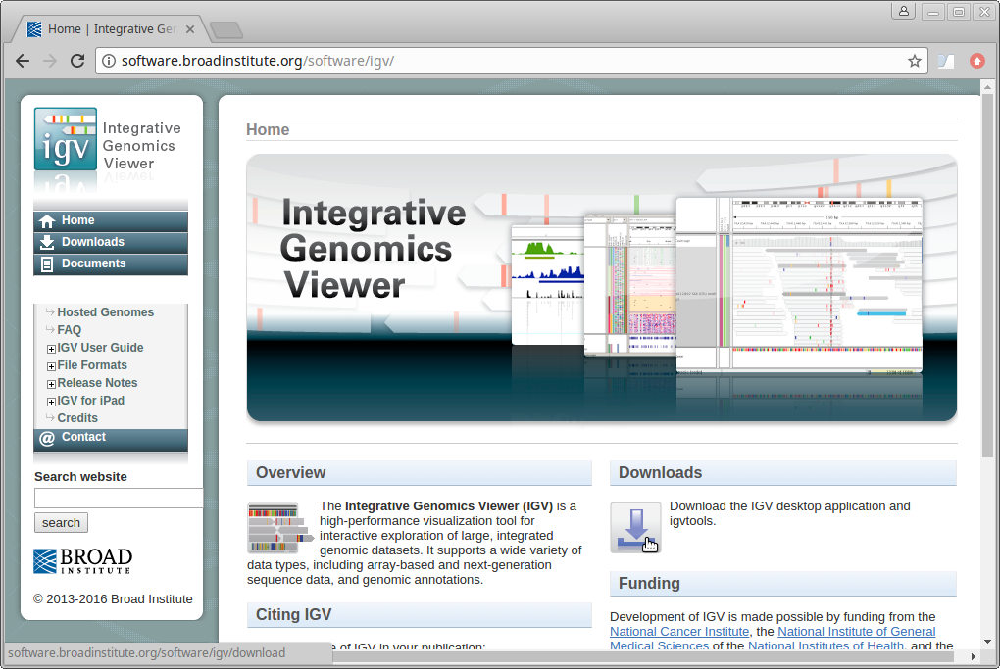

Scroll down the page and under "Java Web Start" click on the "Launch" button with 1.2Gb of memory. This will download a ".jnlp" file which will need to be run using Java Web Start (javaws). If you don't have this on your computer, you will need to install it.

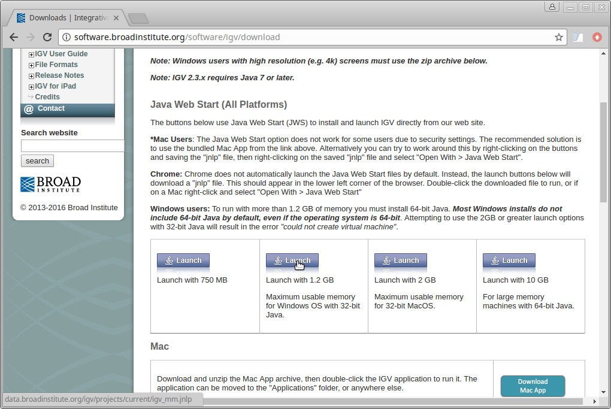

-----

**9\.** IGV should start up automatically. The first thing we want to do is load our reference (chr18.fa). Click on "Genomes" in the menu and choose "Load Genome from File":

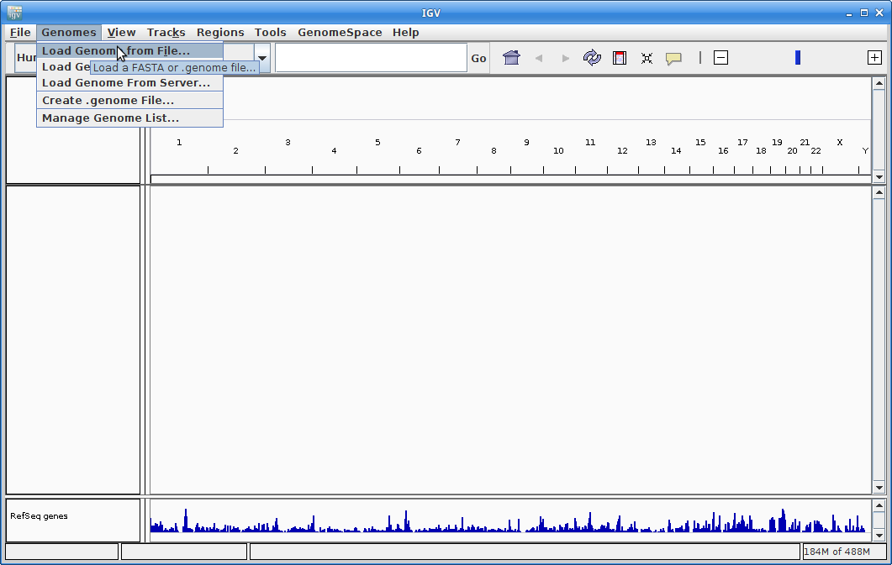

Find your genome file on your laptop and choose that:

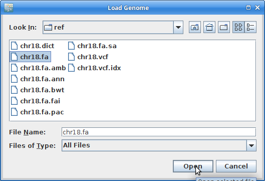

-----

**10\.** Now let's load all the alignments. Go to "File" and choose "Load from File":

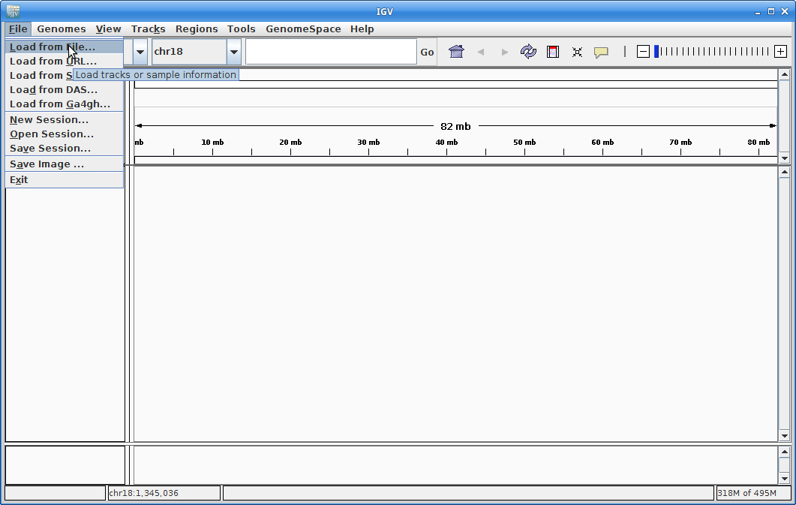

Choose all of the ROI.bam files at once (use the \<Ctrl\> key to choose multiple):

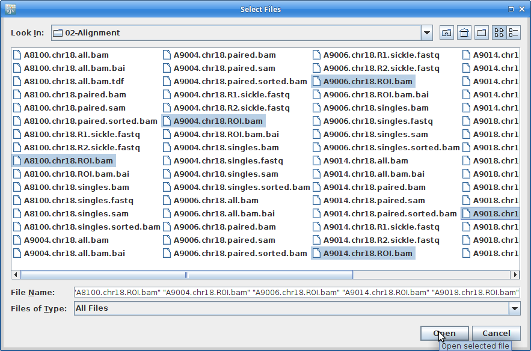

-----

**11\.** This will load all of the alignment, however, you will not see anything until you zoom in. Before we do that, we are going to add coverage tracks that we can see at all zoom levels. Under "Tools" choose "Run igvtools":

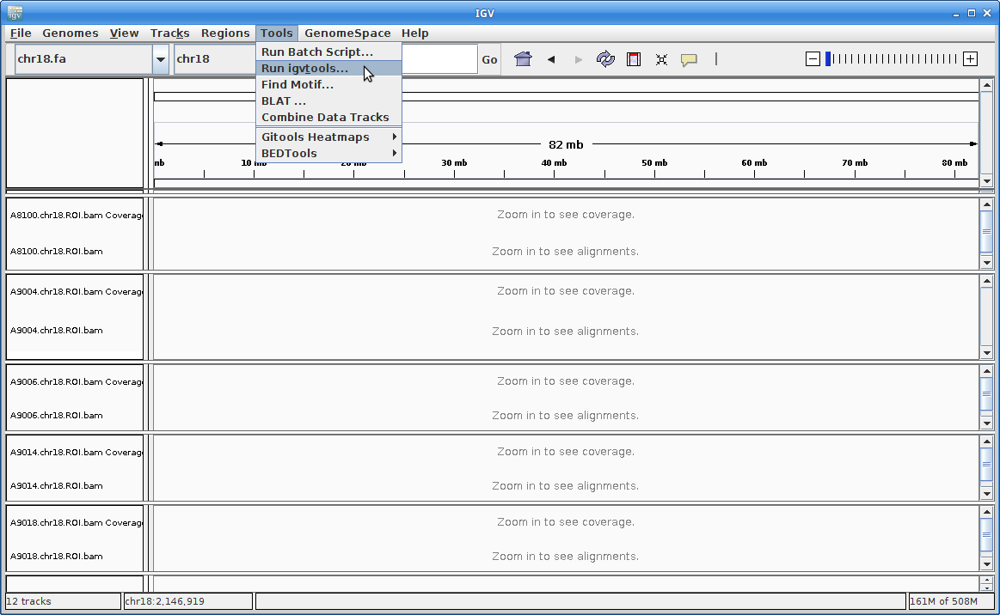

For the Input File, choose **A8100.chr18.ROI.bam**:

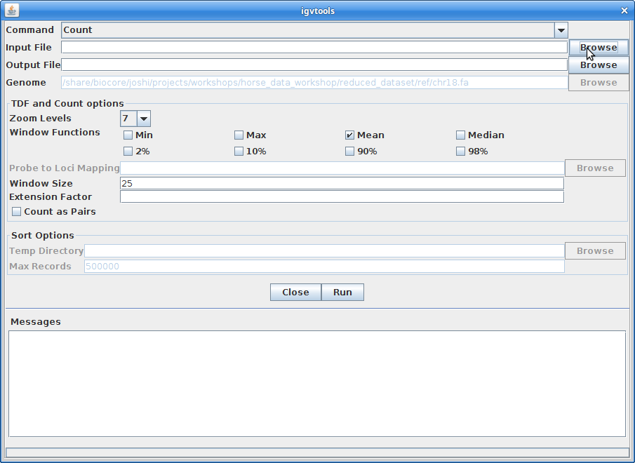

The Output File will be automatically filled in. Choose 10 for the "Zoom Levels". Click "Run":

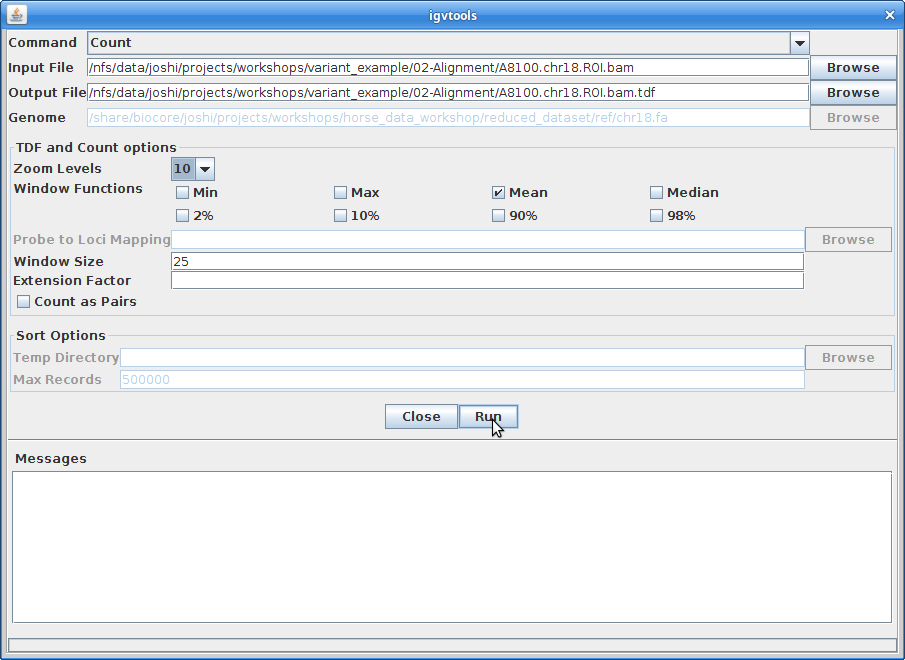

-----

**12\.** Once that finishes, close igvtools. In the main window, choose "File" and "Load from File". Choose the **A8100.chr18.ROI.bam.tdf** file that was created from igvtools:

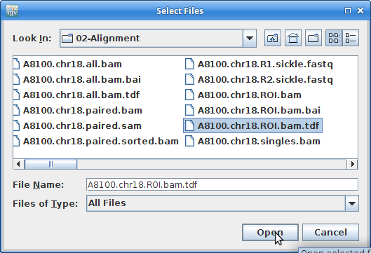

Create coverage tracks like this for all the other samples.

-----

**13\.** Now you should be able to see coverage for each sample across the entire reference. Since we extracted only 1Mb of data for each sample, you will only see coverage in that region. Zoom in to that region be clicking and dragging across the number line at the top:

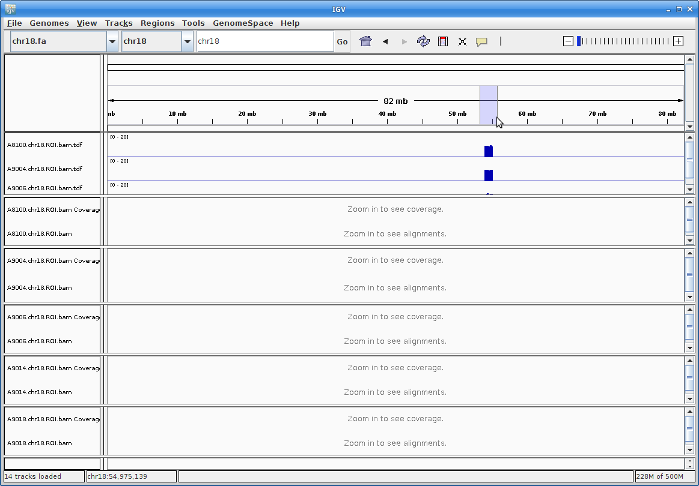

This is still too large a region to view individual alignments, so let's go to the region from the paper. In the text box at the top enter this region: **chr18:54607572-54638829**. Press "Go":

Zoom further into the region:

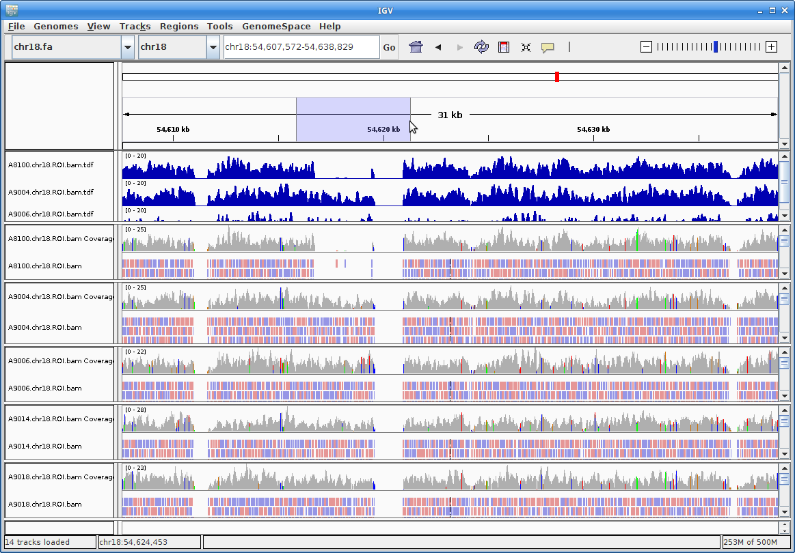

-----

**14\.** Now you can see all the alignments. Within each alignment, each colored bar represents a read. The colors (by default) are based on the strand of the read. You can change this (and other properties) of the tracks by right-clicking (or the equivalent for your laptop) on the track name. For example, choosing "Squished" gives a more compact representation of the alignment. Play around with the various options to see how things change.

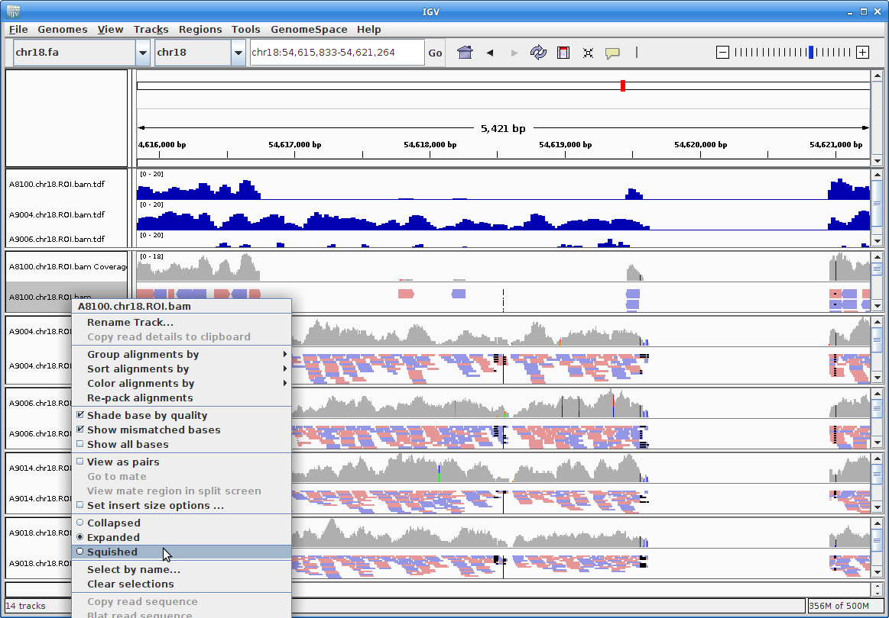

Clicking on a specific read will give you a popup with detailed information about that read:

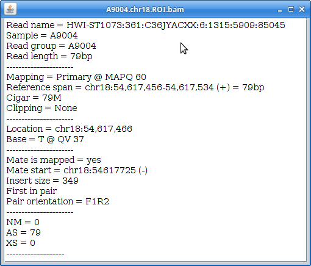
